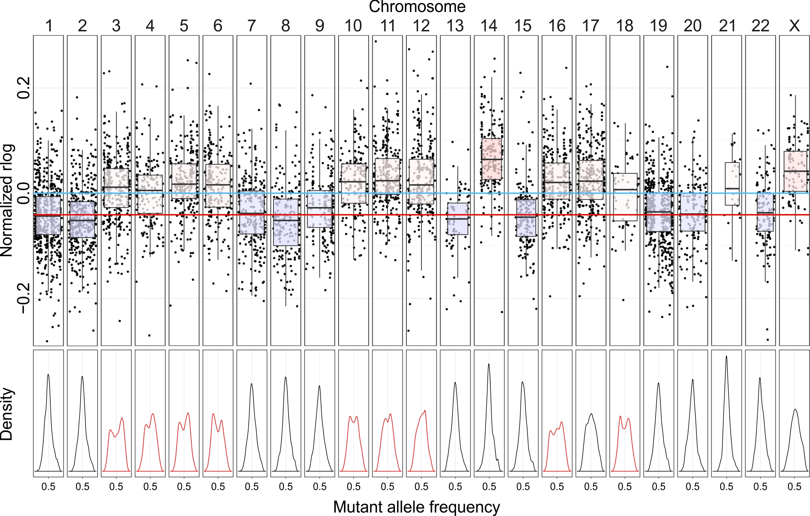

# RNAseqCNV
Infer chromosomal copy number alterations (CNAs) from transcriptome sequencing data. 
The figure shows the possibility of calling CNVs from RNAseq data. Script will be appended later.

Gene expression level (rlog) evaluated by DESeq2 was normalized and shown on each chromosome to indicate whole chromosomal copy number gain or loss (upper). The skyblue line indicates the normalized median gene expression value (rlog) from all the chromosomes, and the red line shows the median expression level of genes on chromosomes with 2 copies. With copy number changes, mutant allele frequency (MAF) of SNVs are changed and the density peaks of MAF are skewed (lower, highlighted in red if the highest peak is not around 0.5). Homozygous duplication of a chromosome could be recognized by elevated gene expression level, but is not noticeable on MAF density plot (e.g., chromosome 14 and 21). With the exception of chromosome 15, the CNAs called from RNAseq were highly consistent with the karyotype: 
61,XX,+X,+3,+4,+5,+6,+10,+11,+12,del(12)(p11.2),+14,+15,+16,+17,+18,+21,+21 (14/70%) 62,idem,+mar (3/15%) 46,XX (3/15%).
